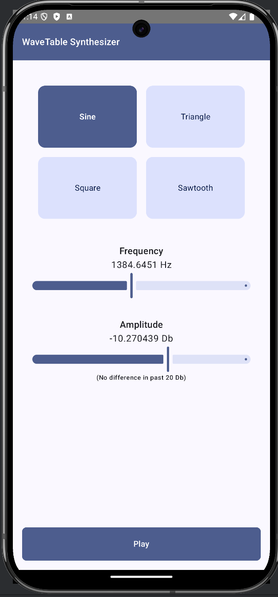

## Wavetable Synthesizer 🎶

**Description**:  
Wavetable Synthesizer is an Android app created as a journey to overcome my own fears of C++. This project combines Kotlin, Jetpack Compose, and C++ through the Java Native Interface (JNI) to explore real-time audio processing in a mobile environment. By diving into C++ and native Android development, I’m facing the challenges head-on, learning, and building something unique.

This app draws inspiration from [this tutorial](https://thewolfsound.com/android-synthesizer-1-app-architecture/) on Android synthesizer app architecture, which guided the initial structure and design.

**Features**:

-   **Customizable wavetable creation** – Craft sounds using sine, triangle, square, and sawtooth waveforms. Each waveform offers unique characteristics:
    -   **Sine** offers a pure, single-frequency tone..
    -   **Triangle** has a softer, rounded sound with odd harmonics.
    -   **Square** delivers a bold, buzzy sound due to strong odd harmonics.
    -   **Sawtooth** produces a rich, full sound because it contains all harmonics.
-   **Real-time sound processing**
-   **Built-in effects to manipulate audio**
-   **Clean UI with Jetpack Compose**

## Screenshots

Here is a screenshot of the app:

**Architecture**
