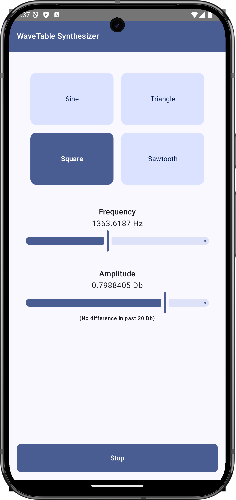
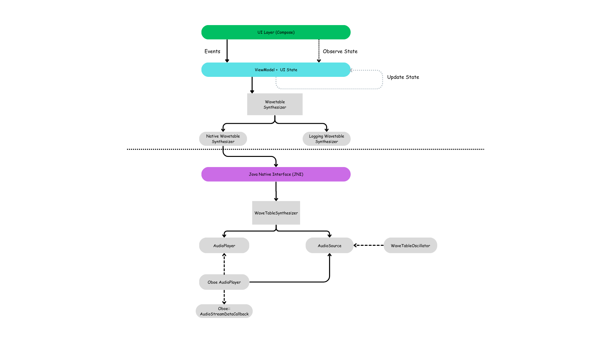

## Wavetable Synthesizer 🎶

### Description

Wavetable Synthesizer is an Android app created as a journey to overcome my own fears of C++. This project combines Kotlin, Jetpack Compose, and C++ through the Java Native Interface (JNI) to explore real-time audio processing in a mobile environment. By diving into C++ and native Android development, I’m facing challenges head-on, learning, and building something unique.

Inspired by [this tutorial](https://thewolfsound.com/android-synthesizer-1-app-architecture/) on Android synthesizer app architecture, this project follows a guided approach for its initial structure and design.

### Features

-   **Customizable Wavetable Creation**  
    Users can design sounds using foundational waveforms, each offering unique characteristics:
    -   **Sine** – Offers a pure, single-frequency tone.
    -   **Triangle** – Has a softer, rounded sound with odd harmonics.
    -   **Square** – Delivers a bold, buzzy sound due to strong odd harmonics.
    -   **Sawtooth** – Produces a rich, full sound because it contains all harmonics.
-   **Real-Time Sound Processing**
-   **Built-in Effects to Manipulate Audio**
-   **Clean UI with Jetpack Compose**

### Screenshots

Below is a screenshot of the app in action:  

### Architecture

The Wavetable Synthesizer architecture combines **Model-View-Intent (MVI)** and **Hexagonal (Ports and Adapters)** to ensure separation of concerns, modularity, and clear boundaries between the UI, business logic, and platform-specific components.

-   **Model-View-Intent (MVI)**:  
    This pattern structures interactions by managing user intents and responses within a unidirectional data flow, making state changes predictable and easy to manage. It supports the app's interactive UI and real-time sound processing needs by clearly separating each layer’s responsibilities and reducing side effects.

-   **Hexagonal Architecture (Ports and Adapters)**:  
    This architecture isolates core logic from platform dependencies like the UI, database, or external systems. By defining "ports" for core actions (e.g., sound processing) and "adapters" for specific platform needs (e.g., Android or C++), it supports modular, testable code and makes future platform integrations easier.

Here’s an illustration of the architecture: 
