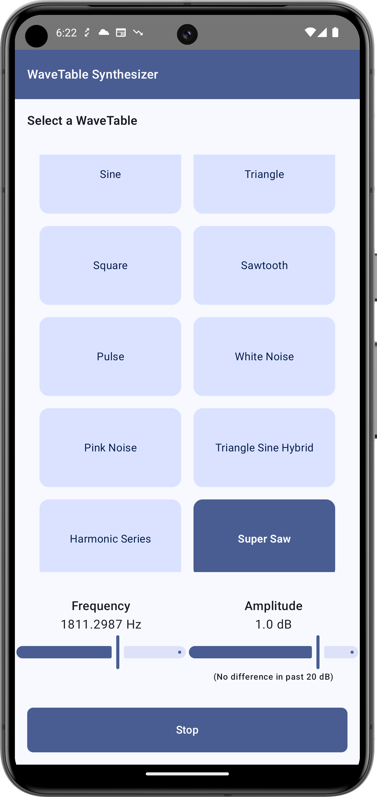

## Wavetable Synthesizer 🎶

### Description

Wavetable Synthesizer is an Android app created as a journey to overcome my own fears of C++. This project combines Kotlin, Jetpack Compose, and C++ through the Java Native Interface (JNI) to explore real-time audio processing in a mobile environment. By diving into C++ and native Android development, I’m facing challenges head-on, learning, and building something unique.

### Screenshots

Below is a screenshot of the app in action: 

### Architecture

The Wavetable Synthesizer architecture combines **Model-View-Intent (MVI)** and **Hexagonal (Ports and Adapters)** to ensure separation of concerns, modularity, and clear boundaries between the UI, business logic, and platform-specific components.

-   **Model-View-Intent (MVI)**:  
    This pattern structures interactions by managing user intents and responses within a unidirectional data flow, making state changes predictable and easy to manage. It supports the app's interactive UI and real-time sound processing needs by clearly separating each layer’s responsibilities and reducing side effects.

-   **Hexagonal Architecture (Ports and Adapters)**:  
    This architecture isolates core logic from platform dependencies like the UI, database, or external systems. By defining "ports" for core actions (e.g., sound processing) and "adapters" for specific platform needs (e.g., Android or C++), it supports modular, testable code and makes future platform integrations easier.

Here’s an illustration of the architecture: 

## Features

### 1. **Extensive Waveform Library**

-   Includes a variety of waveforms: sine, triangle, square, sawtooth, pulse, white noise, pink noise, and more, generated with efficient Fourier series and synthesis algorithms.
-   Supports unique custom waveforms, including:
    -   **Triangle-Sine Hybrid**: Combines the characteristics of triangle and sine waves.
    -   **Harmonic Series**: Allows you to create tables based on selected harmonic overtones.
    -   **Super Saw**: A dense saw wave created by layering multiple detuned voices.
    -   **Bell Wave**: A modulated sine wave that produces bell-like sounds.

### 2. **Real-Time Wavetable Customization and Swapping**

-   Enables smooth real-time switching of wavetables with concurrency handling, so sound continuity is never compromised.

### 3. **Frequency and Volume Controls**

-   Adjust oscillator frequency with real-time recalculations for accurate pitch adjustments across all waveforms.
-   Volume control for smooth amplitude modulation.

### 4. **Playback and Interpolation**

-   Linear interpolation between samples to reduce aliasing and create a more natural sound.
-   Playback resets for consistent audio playback behavior.

### 5. **Noise Generation Options**

-   Features both white and pink noise for more creative possibilities, useful in percussive and ambient sound design.
